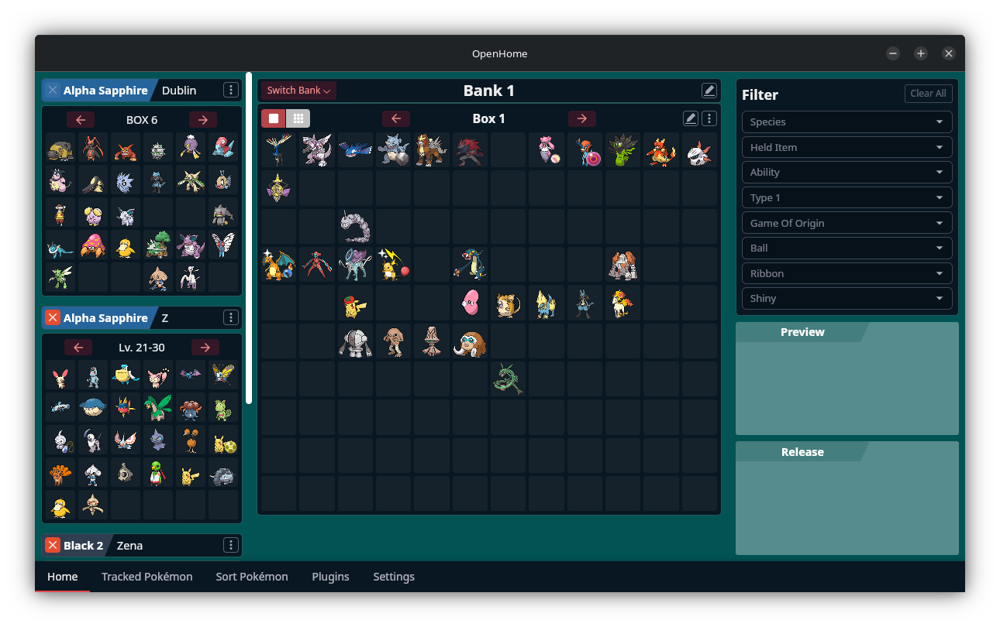
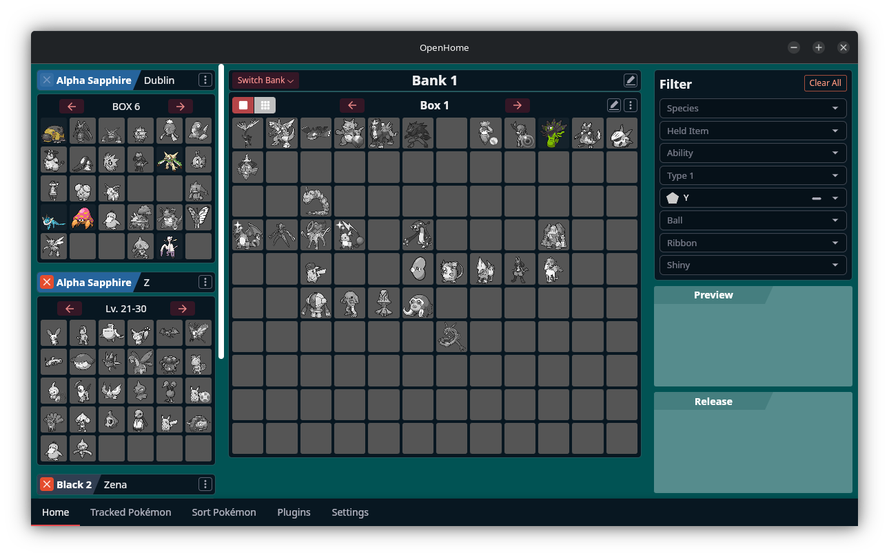
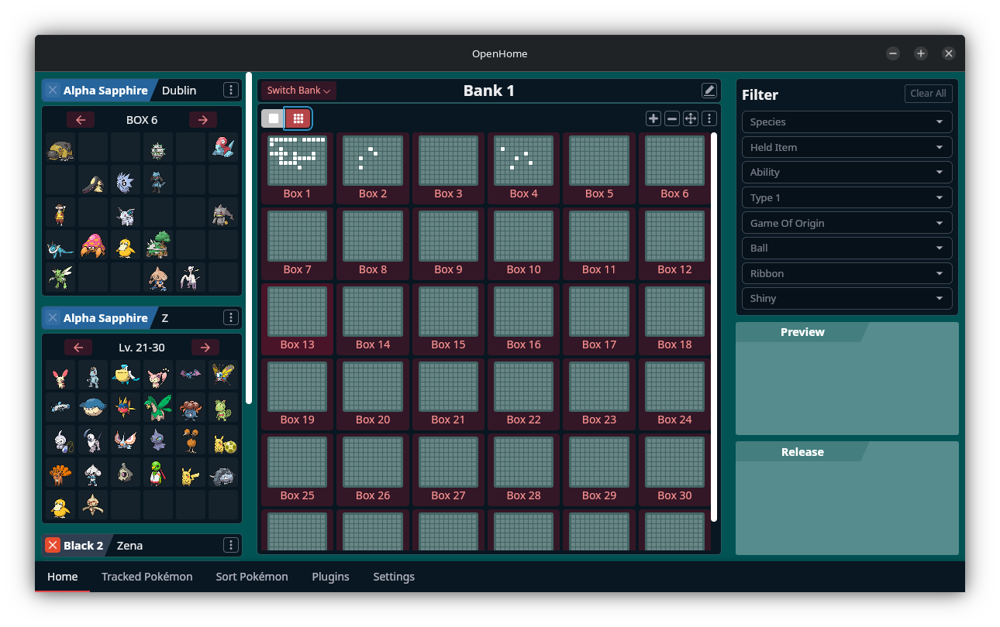
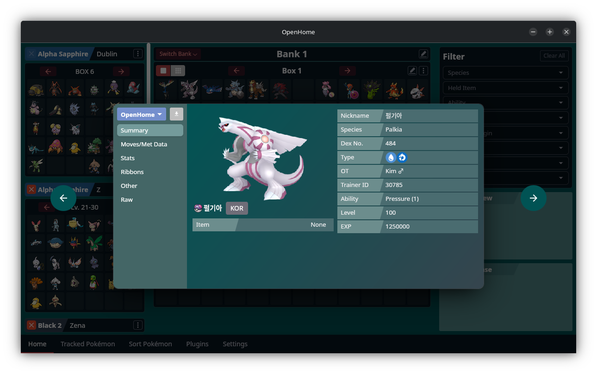
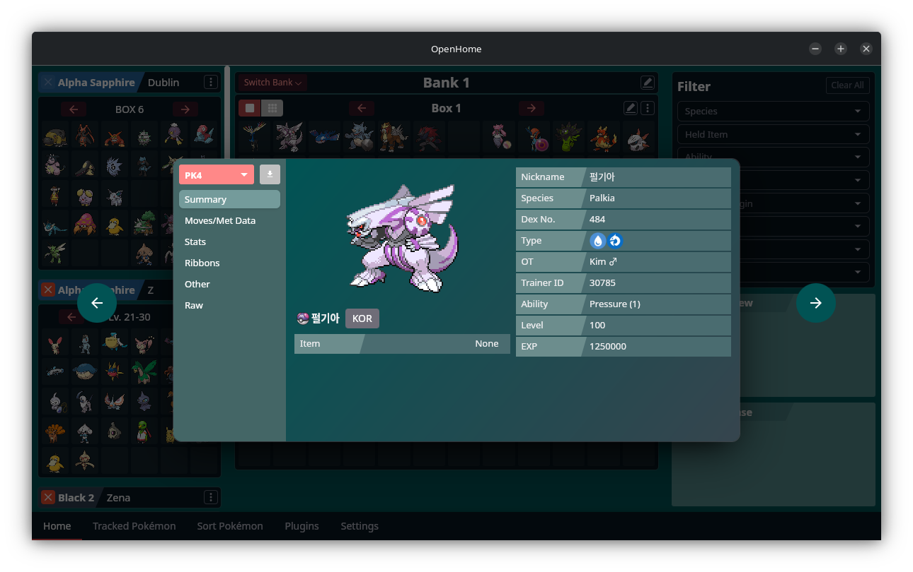
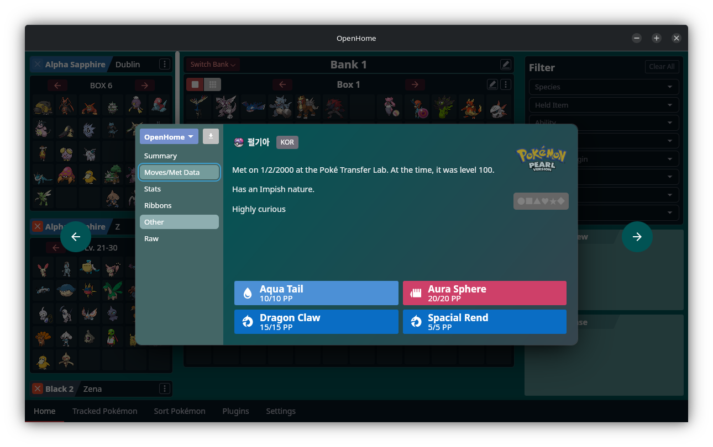
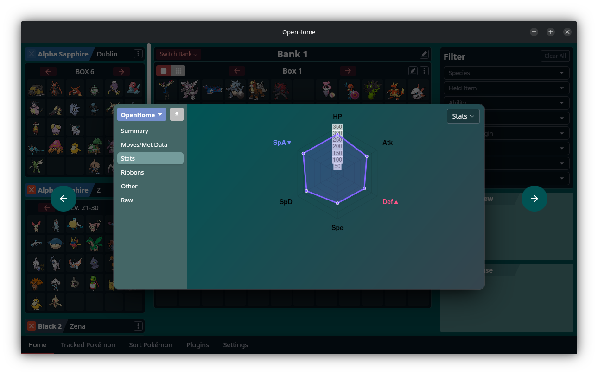
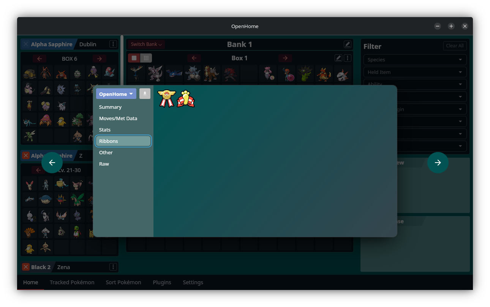
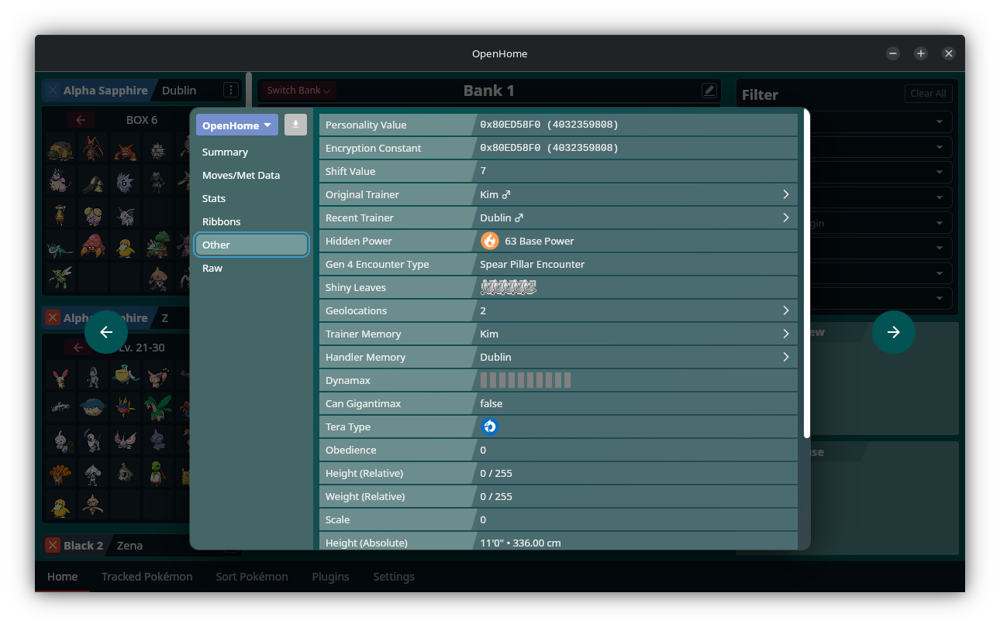

[](https://github.com/andrewbenington/OpenHome/actions/workflows/typecheck_lint.yaml)

<p>
  OpenHome uses <a href="https://tauri.app/">Tauri</a>, <a href="https://facebook.github.io/react/">React</a>, and <a href="https://vite.dev/">Vite</a>.
</p>

# OpenHome

OpenHome is an open source, cross-platform tool for moving Pokémon between games losslessly, much like Pokémon Home on the Nintendo Switch. Unlike Pokémon Home, OpenHome also allows for moving Pokémon to past generations from future ones. When a Pokémon is moved into a save file, its data from other games is saved locally, so nothing is lost when transferring to past generations. For example, you can move your Kalos Champion Sceptile from Pokémon X to Pokémon Ruby, earn it the Artist Ribbon, and it will have both the Kalos Champion and Artist ribbons when moved back to Pokémon X.

Visit the [GitHub Pages site](https://andrewbenington.github.io/OpenHome/) for easy download links and more information.

## Disclaimer

OpenHome is only intended to be used for fun. Pokémon modified by OpenHome are not guaranteed to be legal Pokémon when transferred to a modern Pokémon game, and should never be used in official competitions or online play. Pokémon modified by OpenHome should not be moved into Pokémon Home, and Pokémon that have previously been stored in Pokémon Home should not be modified with OpenHome. Doing so may result in your Pokémon Home account being suspended.

The OpenHome developers do not endorse piracy. There are online guides available with instructions on how to dump save files and ROMs of games from physically owned cartridges.

While we do our best to avoid glitches, it's always a good idea to back up your save files in case of a save corruption error.

## Screenshots












## Downloading and Installing

For quick access to downloads, visit the [downloads page](https://andrewbenington.github.io/OpenHome/download).

On **Windows** and **macOS**, you can also download an installer from that location, but the app will not be signed. Your operating system will give you warnings about running or even downloading the app. If you (understandably) have concerns about that, jump to the [Building App Locally](#building-app-locally) section.

### macOS

On **macOS** visit the [downloads page](https://andrewbenington.github.io/OpenHome/download), and download the latest release using one of the buttons at the top of th page. If you don't know whether you have an Intel or an Apple Silicon Mac, go to  > About This Mac and check whether your Chip is Apple or Intel.

Follow the instructions to move the application to your Applications folder if you'd like. If you run the app by double clicking, it will give you a security error. To bypass this, do the following:

**macOS Sequoia**

macOS Sequoia makes it painstaking to run an app not signed with an Apple certificate (which requires an expensive yearly subscription). Assuming you installed the app in your root Applications folder, you can get around this by running the following in Terminal:

```bash
xattr -cr /Applications/OpenHome.app
```

After you do this you should be able to run the app as normal.

**Older Versions of macOS**

You will only get a security error if you try and open the app by double clicking. You can get around this if you ctrl + click the app, select "Open", and the click "Open" again. You should be able to open it by double clicking after you do this.

### Windows

On **Windows** visit the [downloads page](https://andrewbenington.github.io/OpenHome/download) and download the app using one of the buttons at the top of the page. Unless you're using a laptop with a Snapdragon chip, you will probably want to download the x86_64 version. The Universal download will work anywhere, but it is twice as big.

If you're using Edge, go to the Privacy settings and turn off Windows Defender SmartScreen. Once the file is downloaded, make sure to turn it back on.

### Linux

You can download an rpm, deb, or AppImage file from the [downloads page](https://andrewbenington.github.io/OpenHome/download) depending on your architecture and distribution.

## Building App Locally

If you don't want to bypass your security restrictions to download the app, you can instead download the source code and build the app locally. Follow these instructions:

For [Windows](./docs/BUILD_WINDOWS.md)

For [macOS](./docs/BUILD_MAC.md)

Node and Rust are needed for compilation.

## Moving Between Saves

This video is from an old version; The concept is the same but I'm too lazy to remake it.

[](https://youtu.be/s8MoLsySvOw)

The extra Champion Ribbon in Emerald, 0hp in Blue, and HeartGold/SoulSilver save misidentification are all bugs that have been fixed in the latest version.

## Current Support

Development is ongoing. While OpenHome does its best to convert Pokemon between
formats losslessly, there are sometimes mistakes. It's always a good idea to back up
your save files. If you come across a bug, create an [issue](https://github.com/andrewbenington/OpenHome/issues) to bring it to my attention.

All PKM formats from Generations I-IX are currently supported, including from Pokémon
Colosseum and Pokémon XD. All game save files from Generations I-IX are supported,
except for the Japanese versions of Pokémon Red/Green/Blue/Yellow and the Japanese versions of Pokémon Gold/Silver/Crystal.

### Supported PKM import formats

- PK1
- PK2
- PK3
- PK4
- PK5
- PK6
- PK7
- PA8
- COLOPKM
- XDPKM
- PB7
- PK8
- PA8
- PB8
- PK9

### Supported save file formats

- Pokémon Red/Blue/Yellow (international)
- Pokémon Gold/Silver (international)
- Pokémon Crystal (international)
- Pokémon Ruby/Sapphire
- Pokémon Emerald
- Pokémon FireRed/LeafGreen
- Pokémon Diamond/Pearl
- Pokémon Platinum
- Pokémon HeartGold/SoulSilver
- Pokémon Black/White
- Pokémon Black 2/White 2
- Pokémon X/Y
- Pokémon Omega Ruby/Alpha Sapphire
- Pokémon Sun/Moon
- Pokémon Ultra Sun/Ultra Moon
- Pokémon Let's Go Pikachu/Eevee
- Pokémon Sword/Shield
- Pokémon Brilliant Diamond/Shining Pearl
- Pokémon Legends Arceus
- Pokémon Scarlet/Violet

### Supported ROM Hack formats

- Pokémon Radical Red
- Pokémon Unbound

## Alterations to transferred Pokémon

When moving Pokémon to an older game, some compromises have to be made. OpenHome will
try its best to preserve aspects of a Pokémon such as its nature, ability, gender, and
shininess, all of which are usually possible minus some specific cases in the GameBoy
games. These compromises will be reverted when moving back to a future game.

For example, a Pokémon originating in Generation VI being moved into a Generation III
game will have its personality value altered to preserve its nature, ability (if
possible), gender, and shininess.

A Pokémon transferred into Generation I or II will have it's Original Trainer's ID
changed to a "tracking number" of sorts due to the lack of a Personality Value in
those games.

## Credits

This application would not have been possible without the research done at https://projectpokemon.org/, the work done by the [PKHeX](https://github.com/kwsch/PKHeX) developers, and the sprites archived by https://pokemondb.net/ and https://www.bulbagarden.net/.

Credit to the [Radical Red Team](https://www.pokecommunity.com/threads/pok%C3%A9mon-radical-red-version-4-1-released-gen-9-dlc-pokemon-character-customization-now-available.437688/) for the Radical Red logo, as well as the Pokémon sprites.
