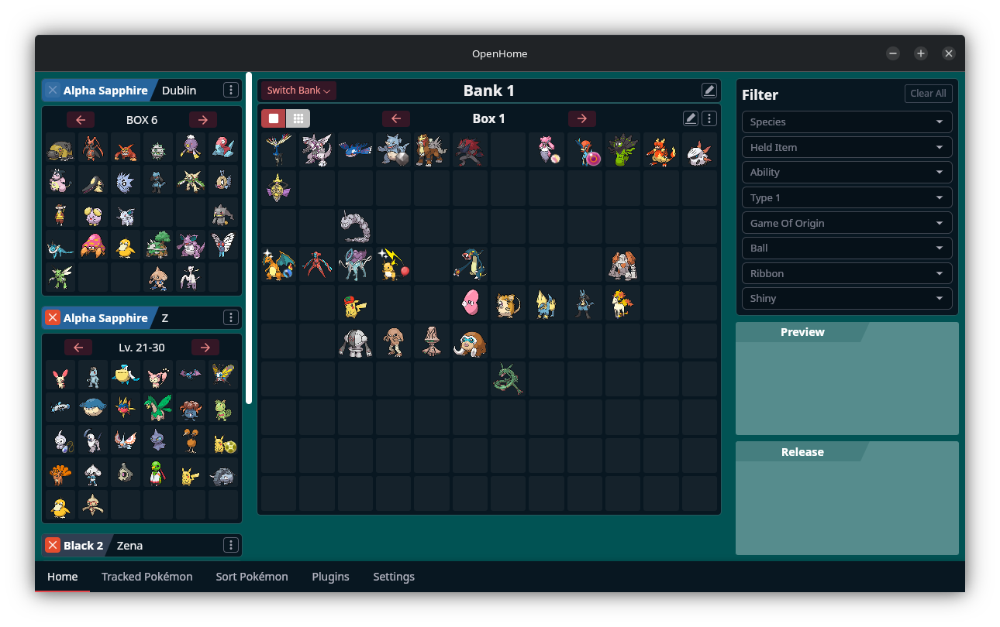
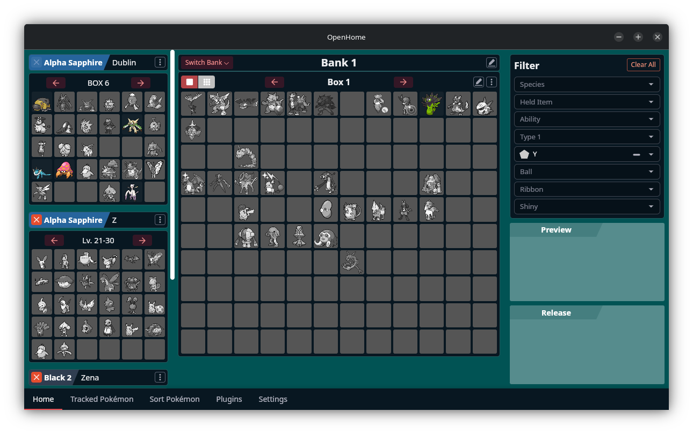
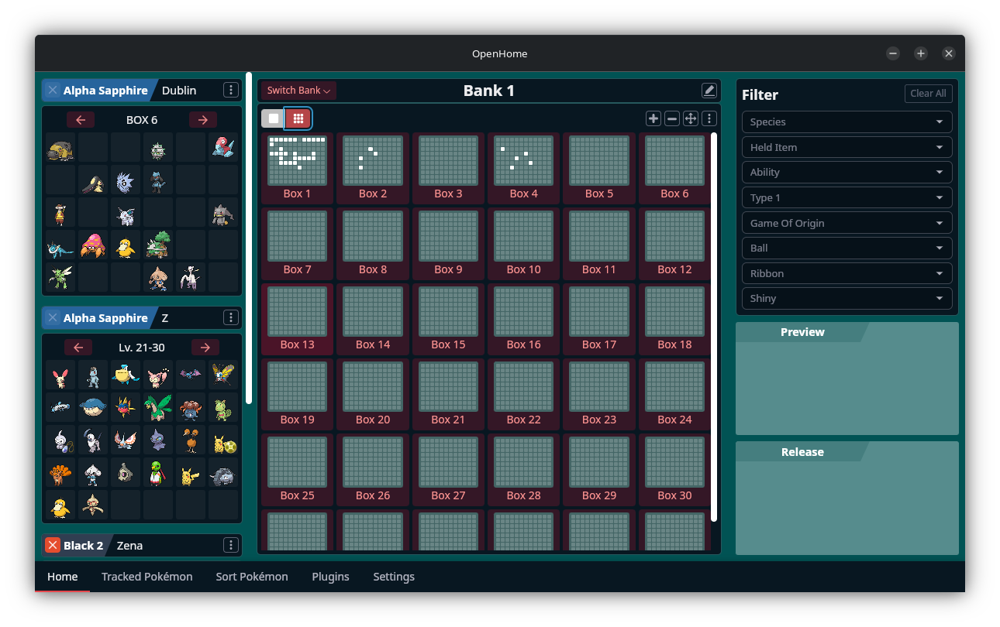
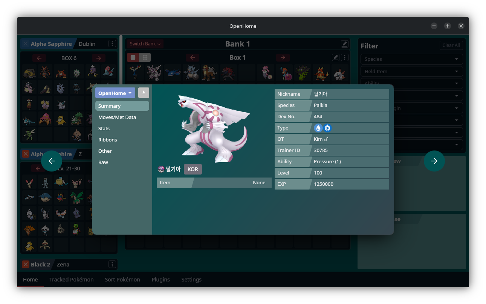
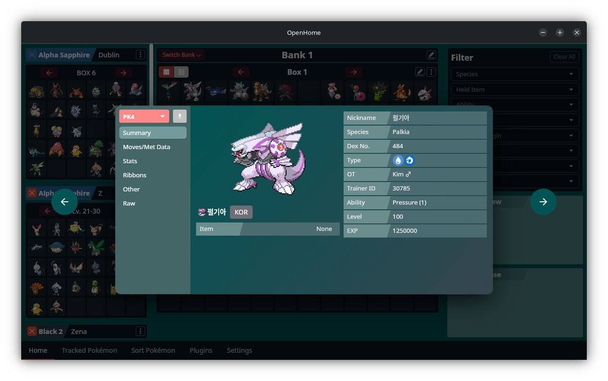
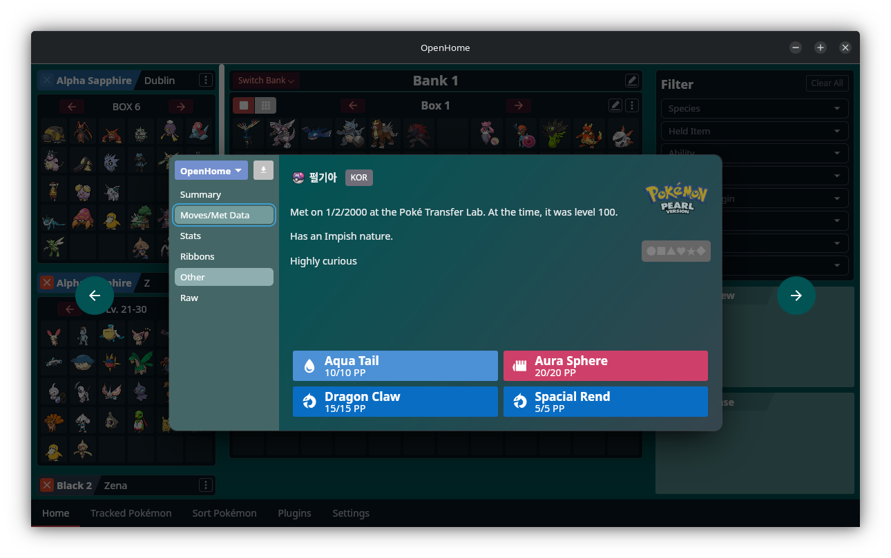
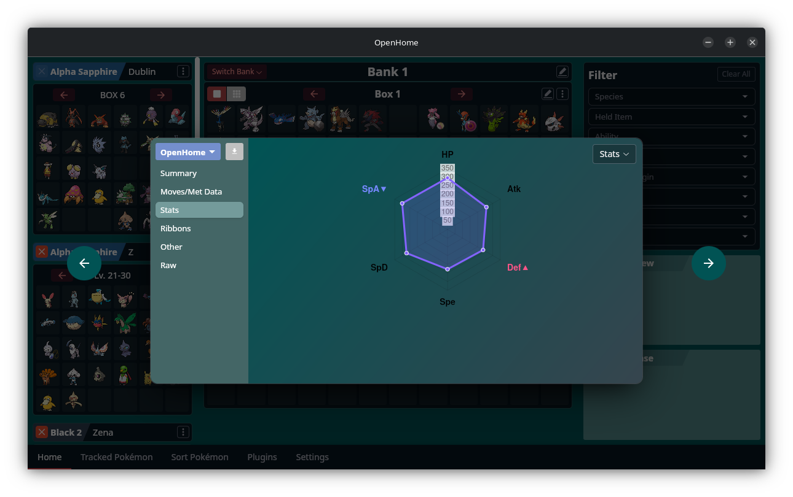
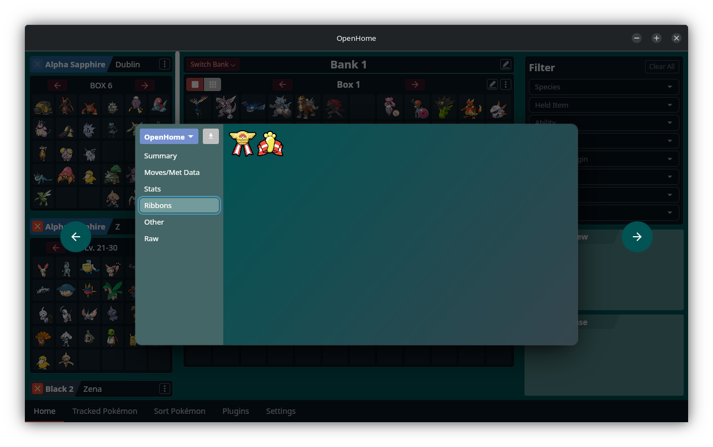
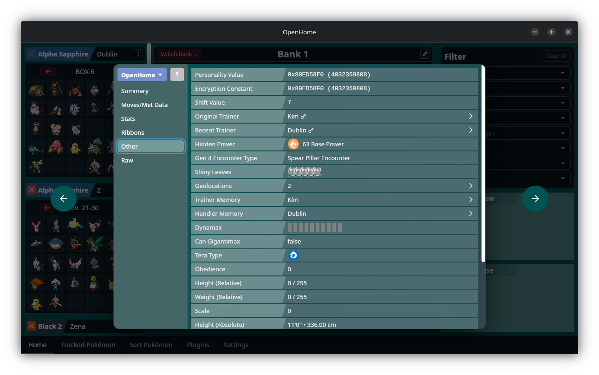

  OpenHome uses <a href="https://tauri.app/">Tauri</a>, <a href="https://facebook.github.io/react/">React</a>, <a href="https://www.radix-ui.com/">Radix UI</a>, and <a href="https://vite.dev/">Vite</a>.

# OpenHome

OpenHome is an open source, cross-platform tool for storing and moving Pokémon between games nearly losslessly, much like Pokémon Home on the Nintendo Switch. Unlike Pokémon Home, OpenHome also allows for moving Pokémon to past generations from future ones. When a Pokémon is moved into a save file, its data from other games is saved locally, so nothing is lost when transferring to past generations.

For example, you can move your Kalos Champion Sceptile from Pokémon X to Pokémon Ruby, earn the Artist Ribbon, and it will have both the Kalos Champion and Artist ribbons when moved back to Pokémon X.

Visit the [GitHub Pages site](https://andrewbenington.github.io/OpenHome/) for easy download links and more information. To build the app yourself, follow the instructions in [INSTALL.md](./docs/INSTALL.md)

## Disclaimer

OpenHome is only intended to be used for fun. Pokémon modified by OpenHome are not guaranteed to be legal Pokémon when transferred to a modern Pokémon game, and should never be used in official competitions or online play. Pokémon modified by OpenHome should not be moved into Pokémon Home, and Pokémon that have previously been stored in Pokémon Home should not be modified with OpenHome. Doing so may result in your Pokémon Home account being suspended.

The OpenHome developers do not endorse piracy. There are online guides available with instructions on how to dump save files and ROMs of games from physically owned cartridges.

**While we do our best to avoid glitches, it's always a good idea to back up your save files in case of a save corruption error.**

## Screenshots

## Building App Locally

If you don't want to bypass your security restrictions to download the app, you can instead download the source code and build the app locally. Follow these instructions:

For [Windows](./docs/BUILD_WINDOWS.md)

For [macOS](./docs/BUILD_MAC.md)

For [Linux](./docs/BUILD_LINUX.md)

NodeJS and Rust are needed for compilation. For Linux, additional dependencies are needed for Tauri to compile. These are listed in the Linux build instructions, but the most up-to-date list is in the Tauri documentation.

## Moving Between Saves

This video is from an old version; The concept is the same but I'm too lazy to remake it.

The extra Champion Ribbon in Emerald, 0hp in Blue, and HeartGold/SoulSilver save misidentification are all bugs that have been fixed in the latest version.

## Current Support

Development is ongoing. While OpenHome does its best to convert Pokemon between
formats losslessly, there are sometimes mistakes. It's always a good idea to back up
your Pokémon and save files. If you come across a bug, create an [issue](https://github.com/andrewbenington/OpenHome/issues) to bring it to my attention.

As of Version 1.10.1, newly tracked Pokémon include a backup of their original data that should remain unchanged.

### Official Formats

All official PKM formats are supported, except for:

- Japanese versions of Gen 1/Gen 2 Pokémon
- Pokémon from Colosseum and XD: Gale of Darkness
- Pokémon HOME files

Japanese Gen 1/Gen 2 and Colosseum/XD save files are also unsupported as of now.

Support for more formats will be added if there is demand for them, and when I have time to work on them.

### ROM Hack formats

PKM and save files for the following ROM hacks are supported:

- Pokémon Radical Red
- Pokémon Unbound
- Pokémon Luminescent Platinum

Forms exclusive to these ROM hacks can be moved into OpenHome and save files of other ROM hacks that support those forms. This includes forms like Stitched Gengar, Balloon Pikachu, and Seviian forms. Support for these forms is new and may have some bugs.

## Alterations to transferred Pokémon

When moving Pokémon to an older game, some compromises have to be made. OpenHome will
try its best to preserve aspects of a Pokémon such as its nature, ability, gender, and
shininess, all of which are usually possible minus some specific cases in the GameBoy
games. These compromises will be reverted when moving back to a future game.

For example, a Pokémon originating in Generation VI being moved into a Generation III
game will have its personality value altered to preserve its nature, ability (if
possible), gender, and shininess.

A Pokémon transferred into Generation I or II will have it's Original Trainer's ID
changed to a "tracking number" of sorts due to the lack of a Personality Value in
those games.

## Code/Research Credits

### PKHeX

This application would not have been possible without the research done at https://projectpokemon.org/, the work done by the [PKHeX](https://github.com/kwsch/PKHeX) developers, and the sprites archived by https://pokemondb.net/ and https://www.bulbagarden.net/.

The PKHeX code was used as a reference for the OpenHome implementation of:

- Reading/writing PKM formats
- Reading/writing save file formats
- Encryption/decryption of PKM and save data
- Reading/writing binary resource files

The following resources are sourced directly from the PKHeX codebase:

- Species/form "personal data" (stats, typing, gender ratio, etc)
- Move learnsets
- Text resources (names of Pokémon, items, moves, locations, ribbons, etc)

### ROM Hacks

Credit to the [Radical Red Team](https://www.pokecommunity.com/threads/pok%C3%A9mon-radical-red-version-4-1-released-gen-9-dlc-pokemon-character-customization-now-available.437688/) for the Radical Red logo, as well as the Pokémon sprites.

Credit to [Team Luminescent](https://luminescent.team/) for the PKLumiHeX program, which provided critical information about the save file structure, and for the Luminescent Platinum logo.

Pokémon Home extra form photoshops were created by [PkmnHomeIcons](https://github.com/nileplumb/PkmnHomeIcons). This includes Stitched Gengar, the Clone Pokémon, and the extra Pikachu forms.

## Star History

<a href="https://www.star-history.com/?repos=andrewbenington%2FOpenHome&type=date&legend=top-left">
 <picture>
   <source media="(prefers-color-scheme: dark)" srcset="https://api.star-history.com/image?repos=andrewbenington/OpenHome&type=date&theme=dark&legend=top-left" />
   <source media="(prefers-color-scheme: light)" srcset="https://api.star-history.com/image?repos=andrewbenington/OpenHome&type=date&legend=top-left" />
   
 </picture>
</a>
